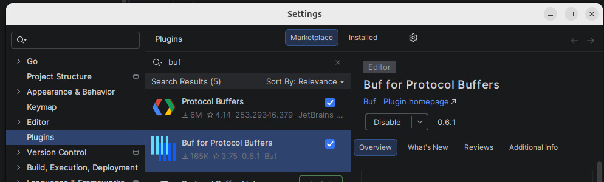
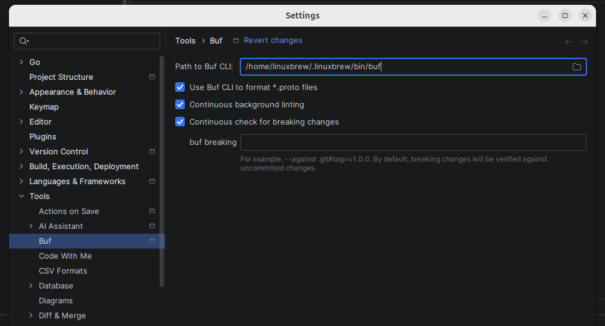

### **1. Clone the Repository**
First, clone the backend repository to your local machine:

`git clone git@github.com:appscode-cloud/cloud-be.git`

### **2. Set Up PostgreSQL Databases**


```
docker run --name casdoor-postgres -d \
  --restart=always \
  -p 5432:5432 \
  -e POSTGRES_USER=postgres \
  -e POSTGRES_PASSWORD=postgres \
  -v casdoor_pg_data:/var/lib/postgresql/data \
  postgres:15-alpine
```
install postgres client"
```bash
sudo apt install postgresql-client
```

Two databases are required. Run the following commands to create them:
```
# Create the casdoor database  
PGPASSWORD=postgres psql -h localhost -U postgres -c "CREATE DATABASE casdoor;"

# Create the cloudcore database  
PGPASSWORD=postgres psql -h localhost -U postgres -c "CREATE DATABASE cloudcore;"

# Create the uuid-ossp extension
PGPASSWORD=postgres psql -h localhost -U postgres -d cloudcore -c 'CREATE EXTENSION IF NOT EXISTS "uuid-ossp";'
```

### **3\. Download GeoIP Database**

The application requires a GeoLite2 database.

* **Download link:** [https://git.io/GeoLite2-City.mmdb](https://git.io/GeoLite2-City.mmdb)
* After downloading, move the GeoLite2-ASN.mmdb file to the ~/Documents folder on your machine.

### **4. Run Casdoor Service**

Run the Casdoor authentication service using Docker. Make sure you have a init\_data.json file in your current directory.

`Get the init_data.json file for Casdoor — note: it includes sensitive test data.`
[init_data.json](https://github.com/user-attachments/files/22996614/init_data.json)

```
docker run -d \
--name casdoor \
--network=host \
--restart=always \
-e driverName=postgres \
-e dataSourceName='user=postgres password=postgres host=127.0.0.1 port=5432 sslmode=disable dbname=cloudcore' \
-e RUNNING_IN_DOCKER=true \
-e CASDOOR_PORT=8989 \
-v $(pwd)/init_data.json:/init_data.json \
casbin/casdoor:latest
```


# Setup to work on this project

1. Add this buf plugin in goland:



2. Run this command
```aiignore
which buf

```
/home/linuxbrew/.linuxbrew/bin/buf

3. Add output path in path to buf cli: 



4. Install buf, protoc-gen-go and protoc-gen-go-connect-go

```aiignore
go install github.com/bufbuild/buf/cmd/buf@latest
go install google.golang.org/protobuf/cmd/protoc-gen-go@latest
go install connectrpc.com/connect/cmd/protoc-gen-connect-go@latest
```
